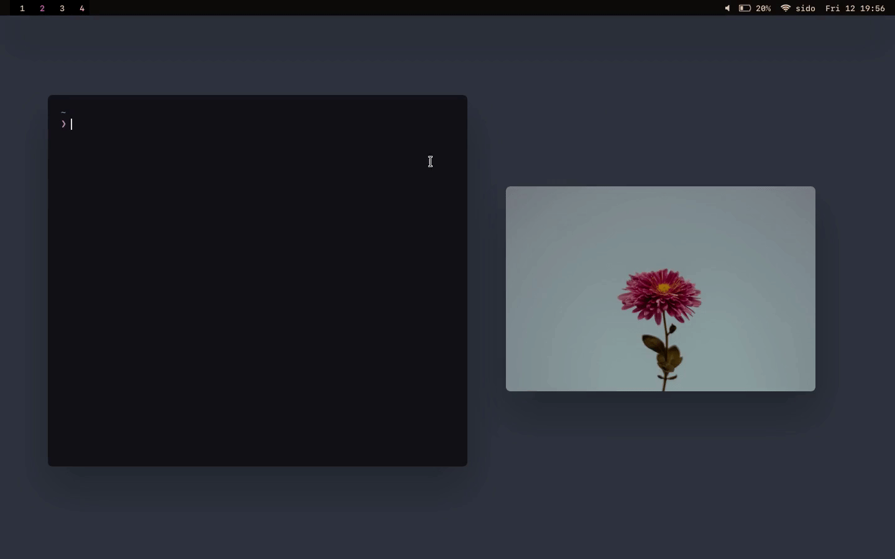

<p align="center"><br><sub>✨ Click on a pixel on your screen and show its color value ✨</sub></p>

```farge``` is command line tool to select pixel on the screen and return the
value of the color in either **HEX or RGB** format. The color code is
automatically **saved to the clipboard**. If you want to save the color, 
```farge``` is able to show the color in a image viewer with the color code on
it. This tool is able to use a varaiety of image viewers like ```feh```,
```mpv``` and ```sxiv```. This tool works on **X11 and Wayland**.

<p align="left">

</a>
</p>


## Dependencies
- ```bash```
- ```imagemagick```
- ```feh``` (Other: ```mpv``` or ```sxiv```, but you must specify it using the ```--image-viewer``` flag)
#### If you use X11
- ```colorpicker``` (https://github.com/ym1234/colorpicker)
#### If you use Wayland
- ```slurp``` (https://wayland.emersion.fr/slurp)
- ```grim```  (https://wayland.emersion.fr/grim)
- ```wl-copy```  (https://github.com/bugaevc/wl-clipboard)


## Installation

### Install as a package
```farge``` is available in the [Arch User Repository](https://aur.archlinux.org/packages/farge-git). If you use Arch or an Arch-based distro, you can use ```makepkg``` or your AUR helper of choice to install the ```farge-git``` package.

### Install using ```make```
```bash
# Clone the repo
$ git clone https://github.com/sdushantha/farge

# Change your current directory to farge
$ cd farge

# Install it
$ sudo make install
```

### Install it locally

```bash
# Download the farge source code, save it as farge
# and make it executeable
$ curl -L https://git.io/raw-farge > farge && chmod +x farge

# Then move farge to somewhere in your $PATH
# Here is an example
$ mv farge ~/scripts/
```

## Usage
```bash
$ farge --help
usage: farge [OPTIONS...]
 
┌─┐┌─┐┬─┐┌─┐┌─┐
├┤ ├─┤├┬┘│ ┬├┤ 
┴  ┴ ┴┴└─└─┘└─┘
Click on a pixel on your screen and show its color value

optional arguments:
   --help                show this help message and exit
   --no-preview          dont show the selected color in a preview window
   --no-color-code       dont write the color code on the preview window
   --rgb                 show the color code as RGB instead of HEX
   --image-viewer        image viewer to use to show the preview (feh, mpv, sxiv)
   --notify              send the color code as notification, where the icon is the selected color
   --expire-time         amount of time the notification should be visible, in milliseconds
   --stdout              output the color value to stdout
   --version             show the version of farge you are using
```

## Tips
It would be smart to bind `farge` to a keybinding. Here is an example for `i3wm` users:
```
bindsym $mod+Shift+f --release exec farge
```

If you use a window manager, you can assign rules the windows so they are
always floating. For `i3wm` user, put this in your config:

```
# Let the windows created by Farge be floating
for_window [instance="Farge"] floating enable
```

## License
MIT License

Copyright © 2019 Siddharth Dushantha
